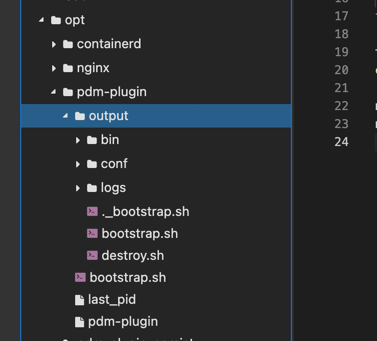

## 部署方式

```shell
sh ./build.sh
# 会打出一个名为 pdm-plugin 的 tar 包，这就是编译产物
# 将产物打包上传至服务器的目录/opt/pdm-plugin下解压
cd /opt/pdm-plugin
# 当前服务器/opt/pdm-plugin目录下有快捷启动脚本，除开启动服务，还附带日志清理、服务停止等逻辑，自行看脚本
sh ./bootstrap.sh
# 如果不用这个脚本，用编译产物自带的脚本也行
sh ./output/bootstrap.sh
```

最终目录结构：


## 原始需求

使用ChatGPT开发简道云的插件需求

一、需求名称：简道云插件

二、需求背景：我们基于简道云开发了PDM系统，受限于简道云平台的能力，部分需求无法直接通过简道云平台实现，需额外开发插件，实现相应的需求。插件与系统间数据对接的方式可以采用API或Webhook。

三、开发方式：通过ChatGPT-4进行开发，通过将需求转译为prompt，输入GPT进行开发，GPT输出代码后，将代码部署测试验证。

四、需求描述：
字段【物料大类-物料编码-物料中文颜色】构成一条数据，每条数据计1，重复时计数累计为2、3、4...
A表单和B表单都有字段【物料大类-物料编码-物料中文颜色】，通过对A表单数据的增删改，实现自动对B表单数据的增删改，要求B表单的数据不重复。
举例
1、A表单数据计数≥1，B表单数据计数=0时：在B表单中新增一条数据
2、A表单数据计数≥1，B表单数据计数=1时：B表单无变动
3、A表单数据计数=0，B表单数据计数=1时：对B表单的该数据标记状态=已取消

五、开发语言要求：不限

六、部署方式：阿里云

七、参考文档：https://hc.jiandaoyun.com/open/11470

八、我们提供：GPT-4账号、简道云开发账号、阿里云账号